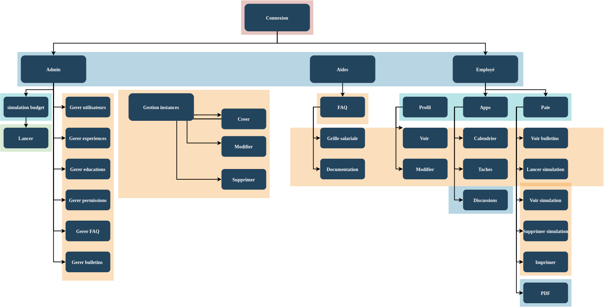
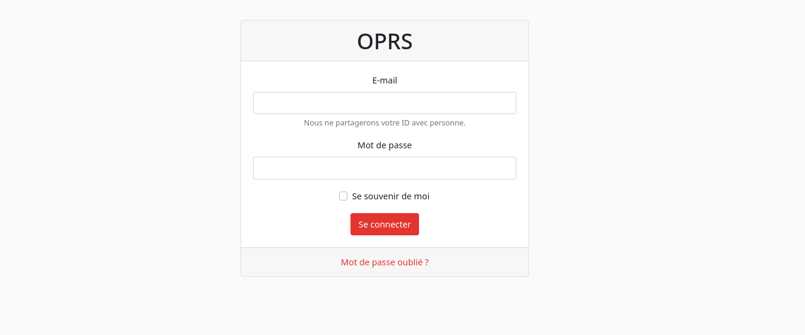
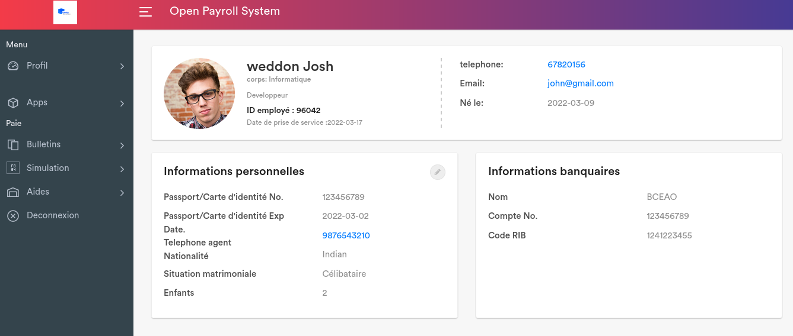
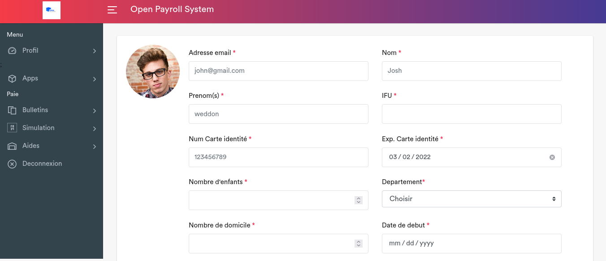
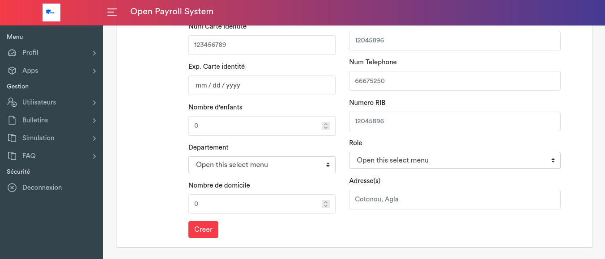
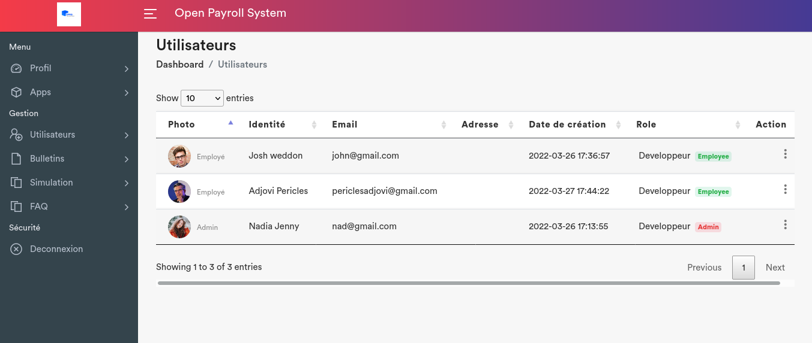
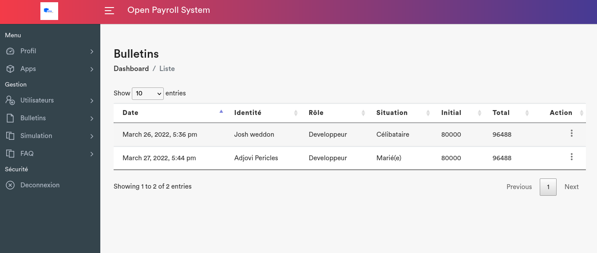

# oprs_payroll_system
Open payroll management system 

## Purpose of the project

The project is aiming to grant a platform for the management of payrolls.
It is a web application that allows the management of payrolls but also gives a set of features that faciliate daily 
tasks.

### Technologies

         

### Architecture 

### Site map

### Users

Two users are defined: 
 * Administrator 
 * Employee

### Admin features

  The project has the following features:

  
  * **User management**: It allows the management of users via (creation/update/deletion).
  * **Payroll management**: It allows the management of payrolls(creation/update/deletion).
  * **Budget generation**: It allows the generation of budgets .
  * **Budget management**: It allows the management of budgets (deletion) .
  * **Leaves management**: It allows the management of employees leaves .
  * **Faq management**: It allows the management of frequently asked questions (creation/update/deletion).

### Employee features

  * **Payroll visualisation**: It allows the employee to view his payrolls at each generation.
  * **Payroll simulation**: It allows employee to generate a payroll based on his/her current salary and a future date.
  * **Events management**: It allows employee to manage his/her events with a calendar .
  * **Task management**: It is a feature that allows employee to manage his tasks todo in a day more accuretely.
  * **Chat**: It allows employee to chat with other employees.
  * **Leaves visualisation**: It allows employee to ask or view his/her leaves.

#### Login page

#### Welcome page

#### Profile update page

#### Employee creation page
 

#### Users list page

#### Payroll management page

## Requirements
 
 You need to have the following requirements installed to run the project:
 * composer
 * php
 * mysql
 * phpmyadmin

### Database

The database which is used in this project is called `payroll` and it is managed with mysql(community edition).

## Installation
 
 You can install the project by running the following command:
  * git clone 
  * cd oprs_payroll_system/app
  * composer install
  * mv .env.example .env
  * php artisan key:generate
  * php artisan migrate

## Usage

 Once you have installed the application, you should run it with:
  * php artisan serve

 You can connect yourself by using the already given credentials.

### Credentials 

  * username: | `root` | `root` | 
  * password: | `root` | `root` |

*Credentials will be given sooner*

## Contributors

